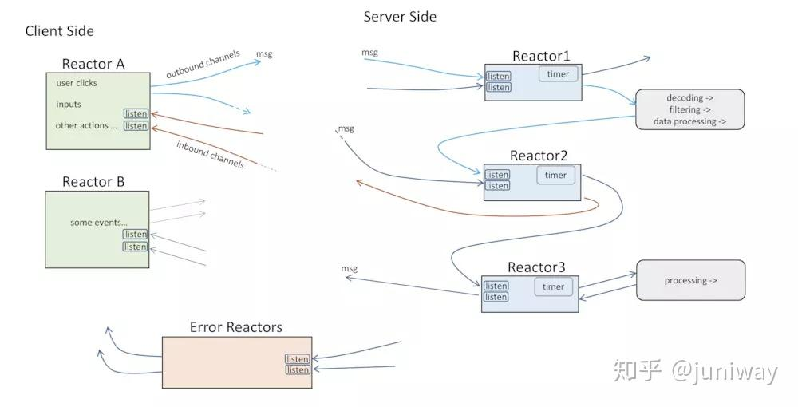

# 响应式编程

## 什么是响应式编程
1. 命令式（Imperative）的代码：它由⼀组任务组成，每次只运⾏⼀项任务，每项任务⼜都依赖于前⾯的任务。数据会按批次进⾏处理，在前⼀项任务还没有完成对当前数据批次的处理时，不能将这些数据递交给下⼀项处理任务。
2. 响应式（Reactive）的代码：它定义了⼀组⽤来处理数据的任务，但是这些任务可以并⾏地执⾏。每项任务处理数据的⼀部分⼦集，并将结果交给处理流程中的下⼀项任务，同时继续处理数据的另⼀部分⼦集。

其实响应式编程没必要跟具体的编程领域关联，它是一个可以普遍适用的概念和编程模型。 Reactor 是⼀个响应式编程库，同时也是Spring家族的⼀部分。它是Spring 5反应式编程功能的基础。

### 同步和异步
同步网络是对消息的到达时间有限定要求（time bounded），以便保证网络活动的确定性。而异步的网络，则对消息的到达没有任何限制。即使发出的消息丢失了，也不会损害网络的活性。

用一个具体的例子来理解就是，节点 A 发送了一个消息给节点 B，期待得到 B 的回复，以便通过某个决议或者完成某件后续事情，这个依赖等待的要求，就是同步网络。因为他依赖一个答复才能进行后续动作。换句话说，如果一个节点发送消息之后，不依赖另一个节点的答复也能正常运行，那么就是异步网络。

### Proactive 和 Reactive
异步网络，对上个任务结果的接收方式：一个是主动的轮训（Proactive 方式），另一个是被动的接收反馈（Reactive 方式）。 
在 Reactive 方式中，上一个任务的结果的反馈就是一个事件，这个事件的到来将会触发下一个任务的执行。

**处理**和**发出**事件的主体称为Reactor，两个Reactors之间没有必然的强耦合，他们之间通过消息管道来传递消息。因此实现 Reactive 模型最核心的是线程和消息管道。线程用于侦听事件，消息管道用于 Reactor 之间通信不同的消息。与他们相关的是事件管理器用于注册、注销事件，而消息分配器则会根据消息类型分发。

## Spring-WebFlux使用
传统的基于Servlet的Web框架，如Spring MVC,在本质上都是阻塞和多线程的，每个连接都会使用一个线程。在请求处理的时候，会在线程池中拉取一个工作者( worker )线程来对请求进行处理。同时，请求线程是阻塞的，直到工作者线程提示它已经完成为止。

在Spring5中，引入了一个新的异步、非阻塞的WEB模块，就是Spring-WebFlux。该框架在很大程度上是基于Reactor项目的，能够解决Web应用和API中对更好的可扩展性的需求。

